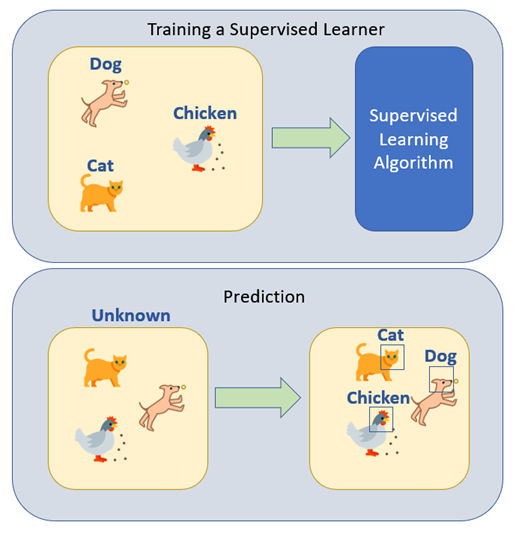

# Reflective on Machine Learning Study Journey

### Introduction

Liu et al (2019) quote a famous statement from Dewey in his book “How We Think”, that we only learn by reflecting on our past experiences instead learn from the experience itself. Reflection is used as an effective activity to gain knowledge using critical thinking. This reflective piece will discuss the study journey of Machine Learning topic.

Since our childhood, we always see movies or cartoons showing intelligent robot character where it has the ability of human or even better. Robots as machines imitate the capability of humans. Today, it's not fiction anymore. The machine really can learn.

The first thing in every discussion about Machine Learning always starts with Alan Turing's idea. He is questioning if the machine can think (Turing, 2004). Alan Turing created an imitation game where computers and humans try to convince a judge to see how it responds to the question. When the judge cannot consistently decide if the response comes from the computer or a human, then the computer wins. Arthur Samuel defines machine learning as the ability of the computer to learn and execute a task without needing to be programmed explicitly (Bell, 2000).

### Legal, Social, and Ethical Issues

In the learning journey of Machine Learning, understood that the legal, social, and ethical issues are aspects that we need to put more attention to. Floridi (2018) in his journal mentioned that it is important on digital transformation, not only we develop a good system, good values, or innovative technology, but also preferable socially. Machine learning which become rapidly growing in computer science should also follow these aspects. It has to be legally accepted by the law in the country where it is implemented. The algorithmic used in machine learning is not harmful (Cath, 2018). As a sample, the algorithmic in machine learning is used to break the security system, this is one example that the algorithmic is harming the system, which is legally unacceptable.

Machine learning always involves large datasets. It becomes an issue if the data source taken from the data were socially or ethically not accepted by society. For example, if private data where no agreement given by the data owner is used, then it is ethically and socially also unacceptable.

### Supervised and Unsupervised Learning

Machine learning is categorized into supervised and unsupervised learning. Machines learn from the label data, either numerical or categorical data. Numerical data as it sounds is a number. While categorical data is represented by a pre-defined set, for example, when we want to identify age range, we can identify as, child, adolescent, adult, or elder. We can understand that categorical data is the set of a category. This kind of machine learning is categorized as supervised learning (Perrotta et al, 2020:2).

Fig 1. Supervised Learning (Jeffares, 2020)

Opposite to supervised learning, unsupervised learning learns based on the unlabelled dataset. We can describe unsupervised learning with a sample analysis of online shopper behavior. Based on their behavior such as, how much they normally spend, which kind of products they like based on their age, the time they purchase the product, and so on, based on this, the machine grouped based on their closest category. This task is also called clustering in unsupervised learning (Perrotta et al, 2020: 11).

.png>)

Fig 2. Unsupervised Learning (Jeffares, 2020)

### Explanatory Data and Correlation Analysis

Exploratory Data Analysis (EDA) in simple words we would say is the process to make the data more make sense by visualizing data in graphs and charts (Patil, 2022).  EDA is an important step to understand the overall data to make the hypothesis. There are a few steps in the EDA process, they are importing the dataset, understanding the data, data pre-processing, understanding the variables, analysis of relational data, and multiple iteration processes to get the conclusion (Andrew, 2022).

During our project assignment on the Analysis of Airbnb data analysis ([https://github.com/indrad123/machinelearning/blob/main/AirbnbAnalysis.ipynb](AirbnbAnalysis.ipynb)), EDA is the first step to analyzing the dataset. If the loaded dataset is set in the variable dt, the python command dt.info() is used to get the information of each variable in the dataset. We can analyze categorical dan numerical data based on the variables in the dataset. The command dt.describe() is used to get all statistical calculations to help the depth analysis of the data.

<figure><figcaption></figcaption></figure>

Fig 3. Sample of Statistical Calculation on EDA

Data visualization such as displaying the data in charts, or histograms, also helps to understand the global picture of the data we analyzed.

The next step after EDA is to analyze the correlation between variables. The correlation is represented as an r value which varies from -1 to 1. If the r value is near 1, there is a positive correlation between variables while if the r value is near -1 there is a negative correlation between variables. If the r value is near 0, there is no correlation between variables. This correlation can help to decide whether the variable can be included or not included in the analysis (Mindrila, nd).

### Machine Learning Algorithms

Linear Regression, Artificial Neural Networks (ANN), and Convolutional Neural Networks (CNN) are named as the algorithms discuss specifically in the module. Linear regression is categorized as a statistical method instead of a Machine Learning method (Bell, 2020: 70). Simple linear regression contains dependent and independent variables. It’s plotted the predictor against the dependent variable.Artificial Neural Networks (ANN) imitate how the human brain works. The input is received by the receptor, is processed by the hidden layer, and finally passes the output after processing. The hidden layer contains an activation function (Ali, 2019). Convolutional Neural Networks (CNN) is a further development of ANN. With the additional layer of convolutional and max pooling, CNN is popular in the computer vision domain (Saha, 2022). The analysis for CIFAR-10 data   ([https://github.com/indrad123/machinelearning/blob/main/CIFAR10-Analysis-2ndAssignment.ipynb](CIFAR10-Analysis-2ndAssignment.ipynb)) shows how ANN and CNN work.

### Final Notes

Machine learning has been an exciting topic. During this study journey, few notes we can conclude as final reflections:

1\.    Legal, social, and ethical should be addressed for any machine learning development project.

2\.    There is a lot of machine learning algorithm and each of them has its own pros and cons. Of course, to be a professional in machine learning, we have to practice and need a lot of exploration for different kinds of models and algorithms.

3\.    In a machine learning project, good collaboration and good time management is the key to a successful implementation.

### References

Ali, A. (2019) _Artificial Neural Network (ANN)_, _Medium_. Wavy AI Research Foundation. Available at: https://medium.com/machine-learning-researcher/artificial-neural-network-ann-4481fa33d85a (Accessed: December 11, 2022).

Andrew, D. (2022) _Exploratory Data Analysis in python - a step-by-step process_, _Medium_. Towards Data Science. Available at: [https://towardsdatascience.com/exploratory-data-analysis-in-python-a-step-by-step-process-d0dfa6bf94ee](https://towardsdatascience.com/exploratory-data-analysis-in-python-a-step-by-step-process-d0dfa6bf94ee) (Accessed: December 11, 2022).

Bell, J. (2020) _Machine learning: Hands-on for developers and technical professionals_. Indianapolis: Wiley.

Cath, C. (2018) “Governing Artificial Intelligence: Ethical, legal and technical opportunities and challenges,” _Philosophical Transactions of the Royal Society A: Mathematical, Physical and Engineering Sciences_, 376(2133), p. 20180080. Available at: [https://doi.org/10.1098/rsta.2018.0080](https://doi.org/10.1098/rsta.2018.0080).

Floridi, L. (2018) “Soft ethics, the governance of the digital and the General Data Protection Regulation,” _Philosophical Transactions of the Royal Society A: Mathematical, Physical and Engineering Sciences_, 376(2133), p. 20180081. Available at: https://doi.org/10.1098/rsta.2018.0081.

Jeffares, A. (2020) _Supervised vs unsupervised learning in 2 minutes_, _Medium_. Towards Data Science. Available at: [https://towardsdatascience.com/supervised-vs-unsupervised-learning-in-2-minutes-72dad148f242](https://towardsdatascience.com/supervised-vs-unsupervised-learning-in-2-minutes-72dad148f242) (Accessed: December 11, 2022).

Liu, M. _et al._ (2019) “Evaluating machine learning approaches to classify pharmacy students’ reflective statements,” _Lecture Notes in Computer Science_, pp. 220–230. Available at: [https://doi.org/10.1007/978-3-030-23204-7\_19](https://doi.org/10.1007/978-3-030-23204-7\_19).

Mindrila, D. and Balentyne, P. (nd) _Scatterplots and correlation - university of west georgia | UWG_. Available at: [https://www.westga.edu/academics/research/vrc/assets/docs/scatterplots\_and\_correlation\_notes.pdf](https://www.westga.edu/academics/research/vrc/assets/docs/scatterplots\_and\_correlation\_notes.pdf) (Accessed: December 11, 2022).

Patil, P. (2022) _What is exploratory data analysis?_, _Medium_. Towards Data Science. Available at: [https://towardsdatascience.com/exploratory-data-analysis-8fc1cb20fd15](https://towardsdatascience.com/exploratory-data-analysis-8fc1cb20fd15)  (Accessed: December 11, 2022).

Perrotta, P. and Dvorak, K. (2020) _Programming machine learning: From coding to Deep Learning_. Raleigh, NC: The Pragmatic Bookshelf.

Saha, S. (2022) _A comprehensive guide to Convolutional Neural Networks - the eli5 way_, _Medium_. Towards Data Science. Available at: [https://towardsdatascience.com/a-comprehensive-guide-to-convolutional-neural-networks-the-eli5-way-3bd2b1164a53](https://towardsdatascience.com/a-comprehensive-guide-to-convolutional-neural-networks-the-eli5-way-3bd2b1164a53) (Accessed: December 11, 2022).

Turing, A. (2004) “Computing machinery and intelligence (1950),” _The Essential Turing_ \[Preprint]. Available at: [https://doi.org/10.1093/oso/9780198250791.003.0017](https://doi.org/10.1093/oso/9780198250791.003.0017).

&#x20;

&#x20;
